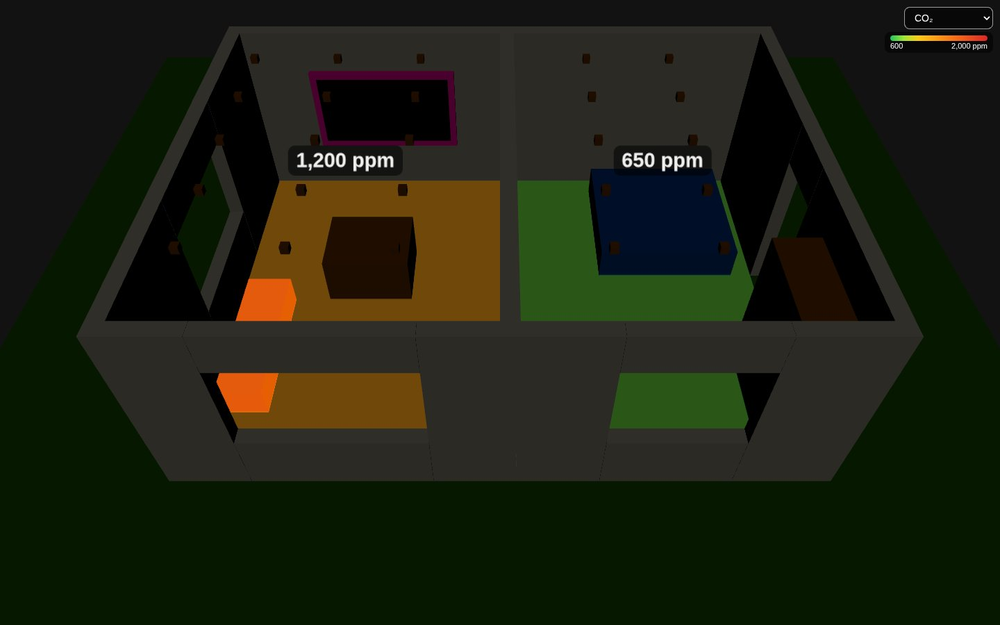
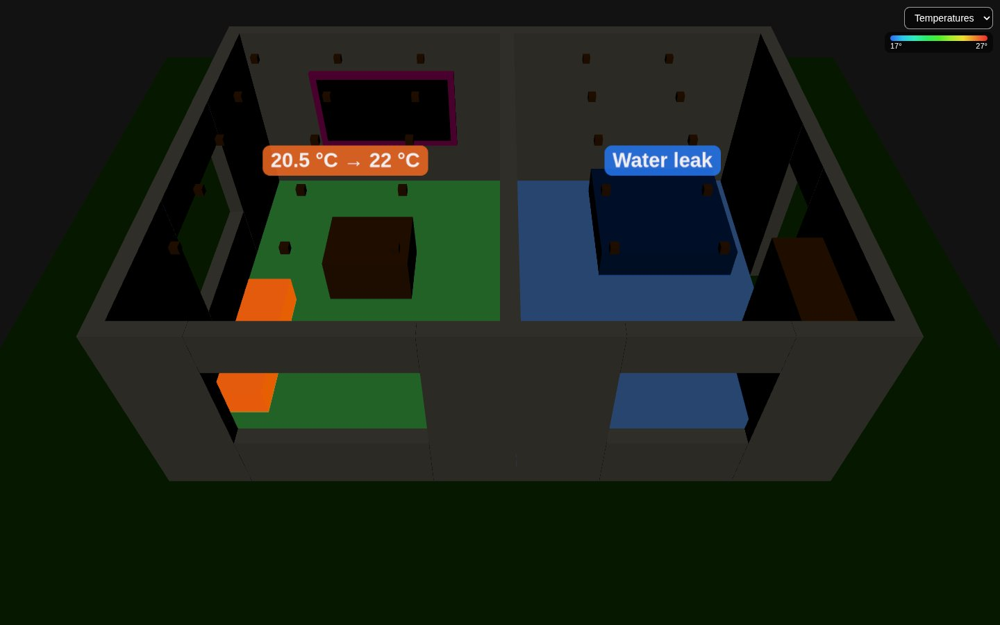
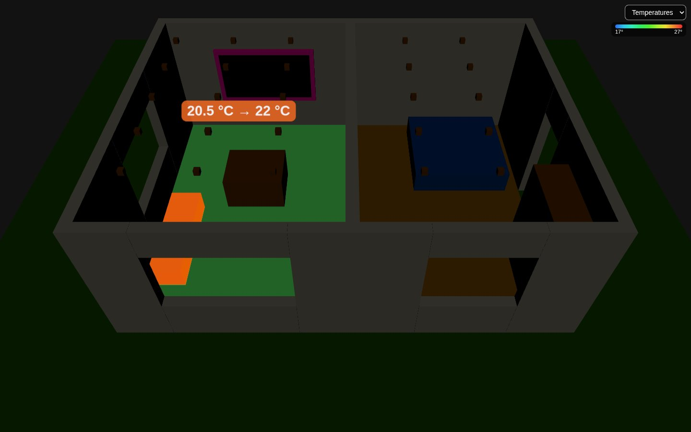
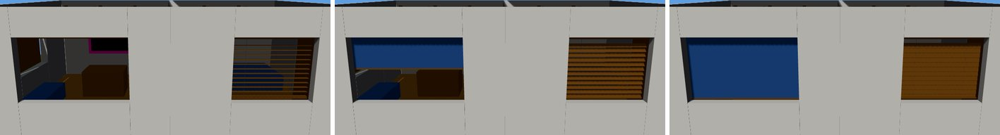
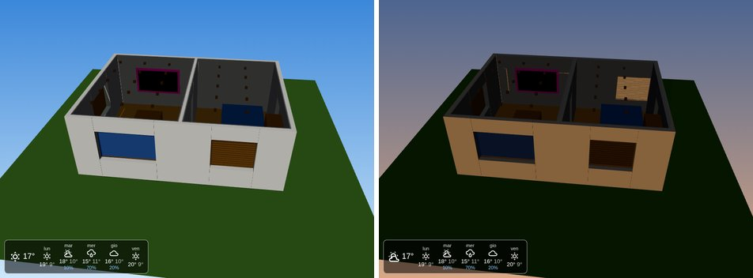
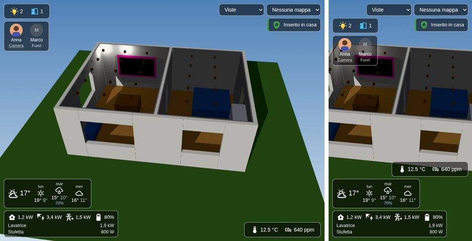

# floor3d-card mod


A fork of [adizanni/floor3d-card](https://github.com/adizanni/floor3d-card) (MIT licence, © adizanni) based on version 1.5.3, with updated libraries, bug fixes and new features. All the options of the original card still work and are documented in [README.md](README.md). This page covers only what is different.

If the fork is useful to you, you can support it on [Buy Me a Coffee](https://buymeacoffee.com/giosci1994u). The original card has its own page: [buymeacoffee.com/AndyHA](https://buymeacoffee.com/AndyHA).

## Installation

### HACS

[](https://my.home-assistant.io/redirect/hacs_repository/?owner=giosci1994&repository=floor3d-card&category=plugin)

1. Open the link above: HACS offers to add this repository. Or add it by hand: in HACS, menu (⋮) at the top right › **Custom repositories**, repository `https://github.com/giosci1994/floor3d-card`, type **Dashboard**.
2. Open **floor3d-card mod** and click **Download**. HACS copies the files of the latest release into `www/community/floor3d-card/` and adds the resource `/hacsfiles/floor3d-card/floor3d-card.js`.
3. Reload the browser or the app. The version is shown at the top of the card editor and in the browser console.

If the original card is installed, remove it from HACS first: both define `custom:floor3d-card` and use the same `www/community/floor3d-card` folder. The configuration of the card stays the same. HACS shows the updates of this fork like those of any other card.

### By hand

1. Download all the `.js` files of the [latest release](https://github.com/giosci1994/floor3d-card/releases/latest) (they are also in `dist/`) into a folder of `config/www`, for example `config/www/floor3d-card/`. There are six files: the card, its core (libraries and code shared with the editor), the editor, which is loaded only when you edit the card, the classic editor, which only old Home Assistant versions load, and the decoders of [compressed models](#compressed-models), loaded only by the models that need them.
2. Add `/local/floor3d-card/floor3d-card.js?v=2.0.0` as a resource of type **module** (Settings › Dashboards › Resources). If the original card is installed too, remove it first.
3. Reload the browser or the app.

At every update copy the new files and change the `?v=` of the resource: Home Assistant serves `/local` with a 31-day cache, and so may a proxy in front of it, while a new query is a new address. The core and the editor have the hash of their content in the name, so they are new addresses too; the ones of older versions can be deleted.

## Building

```bash
npx --yes yarn@1.22.22 install --frozen-lockfile
npm run build        # = rollup -c rollup.config.mjs
npm start            # rebuilds on every change and serves dist/ on port 5000
npm test             # tests of src/config.ts and of the language files (Node 22 or newer)
npm run test:browser # the built card in headless Chromium (after npm run build), see Browser tests
npm run lint         # ESLint on src/*.ts
```

`CARD_VERSION` in `src/const.ts` is shown in the card editor and in the console: keep it equal to `version` in `package.json` and to the tag of the release (see [Publishing a release](#publishing-a-release)). For test builds between releases add a suffix, for example `v2.0.1-dev.1`.

- **Tooling.** Rollup 4 with the official `@rollup/plugin-*` packages, TypeScript 5.9 (target ES2021), Lit 3, custom-card-helpers 2 and the types of home-assistant-js-websocket 9. Babel is gone: without a configuration it did nothing. `.yarnrc` skips the `engines` check because custom-card-helpers 2 asks for Node ≥ 24 for its own development tools, while its code ends up in the browser bundle. three.js went from 0.130 to 0.186; tween.js stays at 18.
- **Lit 2 kept for the classic editor.** The classic editor (`src/editor-classic.ts`, see [Card editor](#card-editor)) uses `@material/mwc-*` 0.27 components, written for Lit 2; on Lit 3 some of them break (for example `mwc-formfield` with the old signature of `@queryAssignedNodes`). The `litForMaterial` plugin in `rollup.config.mjs` makes all of `@material/*` use a single Lit 2 copy (the `lit2` alias in `package.json`), while the card and the new editor use Lit 3. Alias, plugin and classic editor can go once no supported Home Assistant version needs them.
- **Editor loaded separately.** The card doesn't import the editor at startup: `getConfigElement()` loads it when the card is edited. Devices that only show the card download about 850 KB. The build makes four files: `floor3d-card.js` (the card), `floor3d-card-core-<hash>.js` (libraries and code shared with the editor), `floor3d-card-editor-<hash>.js` (the editor with its texts in every language, about 75 KB) and `floor3d-card-editor-classic-<hash>.js` (about 340 KB, loaded only when Home Assistant doesn't provide the components of the new editor). Nothing imports `floor3d-card.js`: the resource has a query (`?hacstag=` added by HACS, `?v=` by hand), and an import without it would load a second copy of the card, whose `customElements.define` fails. `coreChunk()` in `rollup.config.mjs` does this split, and `removeOldChunks()` removes from `dist/` the chunks of older builds. Two more chunks are loaded only by [compressed models](#compressed-models): `floor3d-card-meshopt_decoder.module-<hash>.js` (about 25 KB) and `floor3d-card-DRACOLoader-<hash>.js` (the loader; the Draco decoder itself comes from `draco_decoder_path`).
- **Components Home Assistant no longer provides.** Recent Home Assistant versions don't define `mwc-menu` anymore, so the drop-down menus of the classic editor didn't open. `elements/menu.ts` defines `mwc-menu`, `mwc-menu-surface`, `mwc-list` and `mwc-list-item` only when they are missing. The card also reads `isPanel`, `editMode` and `preview` directly from Home Assistant (2024+), and falls back to the page structure on older versions.

## Publishing a release

1. Change `version` in `package.json` and `CARD_VERSION` in `src/const.ts` (for example `2.0.1` and `v2.0.1`), run `npm run build` and commit, `dist/` included.
2. On GitHub, **Releases › Draft a new release**: a new tag named after the version (`v2.0.1`), a description of the changes, **Publish release**.
3. The Release workflow builds the card and attaches the `.js` files to the release. HACS downloads them from there, and shows the update when it next checks the repository (**Update information** in the menu of the repository checks at once).

The Validate workflow runs the HACS checks at every push and every night; the Build workflow runs `npm run lint`, builds the card and runs `npm test`.

## New features

- **Animated shower** (`type3d: shower`): particles falling while the entity is `on`. Options under `shower:`: `count`, `velocity`, `size`, `color`, `width`, `height`. The animation speed doesn't depend on the frame rate.
- **Person trackers** (`type3d: tracker`) for presence radars that report target coordinates, such as the HLK-LD2450. See [Trackers](#trackers).
- **TV screen** (`type3d: image`): shows the `entity_picture` of a media player and lights the room with the average colour of the picture. Options under `image:`: `rotate`, `mirror`, `lumens`, `lighting_lumens`, `lighting_direction`, `lighting_off_state`, `lighting_distance`, `lighting_shadow: no`. The light is off with `off`, `standby`, `unavailable` and `unknown`. With `lumens` the picture glows; without, it is lit by the room like a printed picture.
- **Info boxes** (`type3d: info`), a **zoom menu** (`hideZoomMenu`) and zoom areas defined by camera position, target and rotation.
- **Pause while hidden**: nothing is rendered while the card is not visible (IntersectionObserver).
- **Compressed models** (2.3): `.glb` files compressed with meshopt or Draco, often several times smaller. See [Compressed models](#compressed-models).
- **Views from the page address** (2.3, `url_parameters`): a button that navigates to `?area=kitchen` opens the card on the kitchen view. See [Views from the page address](#views-from-the-page-address).
- **Fans that speed up and slow down** (2.3, `rotate.ramp`). See [Fans](#fans).
- **Loading screen** (2.3): a bar with the step (materials, model, preparing the 3D scene), the percentage and the megabytes, in the colours of the theme. Before, only "1/2: 45%" in a corner, stuck at 100% while the model was being prepared. A model that doesn't load shows the file and the reason in the card.
- **Object ids with `*`** (2.3): `object_id: Lamp_*` stands for all the matching objects. See [Object ids with *](#object-ids-with-).
- **Sun and sky from sensors** (2.4): `sun_power` can be a numeric sensor, and `sky_power` adds the light of the sky, which fills the shade without shadows. Under clouds the card shows soft light instead of hard patches of sun. See [Sun and sky from sensors](#sun-and-sky-from-sensors).
- **Illuminance map** (2.5): rooms coloured by the lux of an illuminance sensor, next to the temperature and presence maps. See [State colours](#state-colours).
- **Paused preview** (2.5): the card editor can pause its preview while you edit, and sends the configuration to Home Assistant a second after the last change instead of at every keystroke. See [Card editor](#card-editor).
- **One light for a lamp** (2.6, `light.single`, `light.light_object`): a lamp made of several objects (a chandelier, a row of spots) gets one light instead of one per object, so fewer shadows. See [Shadows](#shadows).
- **Sensor maps** (2.7): rooms coloured by humidity, CO₂, PM2.5, PM10, VOC, formaldehyde, radon, noise or the power of their smart plugs, with a legend under the Map menu, and maps of any other sensor. See [Sensor maps](#sensor-maps).
- **Alarms** (2.7): a room blinks in red with a smoke, gas or carbon monoxide sensor on, in blue with a water leak, with the kind of alarm written on it; an object can blink too, and the camera can go to the room. See [Alarms](#alarms).
- **Heating and cooling** (2.7): a radiator, a split or a heated floor glows orange while it heats and light blue while it cools; on the temperature map a room shows the target of its thermostat. See [Heating and cooling](#heating-and-cooling).
- **Roller shades and venetian blinds** (2.8): `cover.motion: shrink` shortens a roller shade or a curtain toward its side instead of sliding it, and `cover.slats` turns the slats of a venetian blind with its tilt, also when slats, rails and cords are one object. See [Covers](#covers).
- **Sky that follows the sun** (2.8, `backgroundColor: sky`): dark blue at night, orange at sunrise and sunset, light blue by day, grey with clouds. See [Sky and weather](#sky-and-weather).
- **Weather forecast** (2.8, `weather`): a box in a corner with the weather now and the next days or hours. See [Sky and weather](#sky-and-weather).
- **Boxes** (2.9): what is on or open (a tap shows it in the model), energy, people, alarm panel and chips, next to the weather, each with a switch to show or hide it. They stack in their corners without covering each other, also on a phone. `hideMapMenu` hides the Map menu. See [Boxes](#boxes).
- **Languages** (2.6): the card and its editor in English, Italian and German (the card also in Norwegian). Each user sees the language of their Home Assistant profile; the `language` option sets one for the card. See [Languages](#languages).
- **Shadows in the editor** (2.6): the card editor says how many lights cast a shadow and how many the device can draw, and names the lights left without. See [Shadows](#shadows).
- **Version label** at the top of the card editor and in the console banner.
- The sky of the original card (`sky: yes`) and its ambient light are removed on purpose, so that they don't affect the render. Besides drawing a sky around the model, `sky: yes` changed the colours and the lights: no light following the camera, a sand-coloured ground under the model, and a sun fixed where it was when the card opened. The option is still accepted, and ignored. The light of the sky of 2.4 (`sky_power`) is there only when it is set, and since 2.8 `backgroundColor: sky` draws a sky behind the model that follows the sun and changes nothing else (see [Sky and weather](#sky-and-weather)). The light that follows the camera (torch) is always on.

|  |  |
| :---: | :---: |
| TV screen (`type3d: image`): the picture of the media player lights the room | Animated shower (`type3d: shower`) |

### Card editor

The editor is built on the components of Home Assistant, like the editors of the built-in cards: the same fields, entity pickers, toggles and menus, in the light and dark themes.

|  |  |
| :---: | :---: |
| Settings in sections, then the lists of entities, object groups and views | Editing an entity: its objects are highlighted in the preview |

- **Settings in sections**: 3D model, camera and navigation, light and shadows, interaction (with the overlay), state colours and room maps (with the rooms), rendering. The yes/no options are toggles, and the help text of each field gives the value used when it is empty.
- **Lists** of entities, object groups, views (zoom areas), rooms and colour conditions: one line per item, dragged to change the order, with a pencil to edit it. An entity shows its type and object, and a warning when the entity doesn't exist, or when the object isn't in the model (after exporting the model again, for example).
- **Editing an item** opens its own page: the entity with the Home Assistant entity picker, its type, its object, then only the options of that type (changing the type takes away the options of the old one), and in a closed panel the tap and long press actions and the template.
- **Objects of the model**: the object menus list the groups and all the objects of the model, with a search; any other name can be typed too. The names come from the preview, or from `objectlist` when set.
- **Pick in the preview**: the button next to an object field turns the preview into a picker: a tap on an object fills the field. For an object group, every tap adds an object or takes it out, until the button is pressed again.
- **Highlight**: while an item is edited, or the mouse is over its line, its objects are outlined in the preview, groups included.
- **Use the current view**: in a view (zoom area), the button copies the position, target and rotation of the camera of the preview, after it has been moved there with the mouse or fingers.
- The **refresh** button next to the version reloads the preview.
- **Fewer reloads of the preview** (2.5): Home Assistant builds the preview again, model included, at every configuration it gets. The editor sends it one second after the last change, and at once when you leave a field or click anywhere (the Save button included), so typing an entity id reloads the preview once instead of at every keystroke, and Home Assistant always has the last configuration.
- **Shadows on this device** (2.6): with shadows on, the light section says how many lights cast one and how many the GPU of the device running the editor can draw. Past that, a warning names the entities whose lights are drawn without shadow, and the material of the model that lowers the limit with its textures; their lines in the list of entities say so. See [Shadows](#shadows).
- **Pause** (2.5): the pause button next to refresh (also at the top of each entity, group, view and room) keeps the last picture of the preview, with "Preview paused" on it, while you make several changes; the play or refresh button shows them all at once. The configuration still goes to Home Assistant at every change, so Save never loses one. The idea comes from [issue #13](https://github.com/giosci1994/floor3d-card/issues/13).
- **Picking and the current view keep the pause** (2.7): "Pick in the preview" loads the model in the paused preview and the pause stays, also after the object is picked (the objects of a group can be picked one after the other); "Use the current view" takes the camera of the last live preview. Before, both resumed the preview, which went back to the initial view.
- **The camera stays** (2.7): Home Assistant creates the preview again at every change of the configuration, and it went back to the initial view, so zoom and camera had to be set again after each change. The new preview goes back to where the camera was, unless the initial view or the model changed. The picture of a paused preview is the last one, with the camera where it was.
- When Home Assistant doesn't provide the components the editor is built on (`ha-form` and `ha-expansion-panel`), the editor of version 2.1 is shown instead (`src/editor-classic.ts`). The new editor was tested on Home Assistant 2026.9.

The editor and the preview talk through window events (`floor3d-card-editor` and `floor3d-card-preview`, see `src/editor.ts`); only a card that Home Assistant marks as `preview` answers.

### Languages

The card and the editor show the language of the profile of each user in Home Assistant, so in the same house everyone sees their own; `language` (`en`, `it`, `de`, `nb`) sets one for the card and its editor, whatever the profile. A regional variant uses its language (`de-CH`: German), and a language without texts shows English.

| Language | Card | Editor |
|---|---|---|
| English | ✓ | ✓ |
| Italiano | ✓ | ✓ |
| Deutsch | ✓ | ✓ |
| Norsk bokmål | ✓ | English |

The texts are in JSON files: `src/localize/languages/<code>.json` for the card (menus, loading screen, errors) and `src/localize/editor/<code>.json` for the editor (labels, help texts, menus, headings), loaded only with the editor. A text missing in a language is the English one. To add a language:

1. copy the two `en.json` files to `<code>.json` (the code Home Assistant uses: `fr`, `es`, `pt-BR`…) and translate the texts, leaving `{name}` placeholders as they are;
2. add the file to `languages` in `src/localize/localize.ts` and in `src/localize/editor.ts`, and the code to the `language` menu in `src/editor-schema.ts` (with its name under `options.language` in the editor files);
3. add the code to the lists of languages in `test/i18n.test.mjs`: `npm test` checks the languages listed there, that every key exists in English and that the placeholders match.

The classic editor (`src/editor-classic.ts`, for Home Assistant versions without the components of the new editor) stays in English.

### Shorter configuration

The editor writes only what the card needs:

- no empty rows: a new entity, object group or zoom area goes into the YAML once something is filled in (the editor keeps showing it meanwhile);
- no empty options blocks (`camera: {}`) and no empty values;
- no switch left at its default value (`header: 'yes'`, `click: 'no'`, `shadow: 'no'` and so on), nor the overlay size and colours when they are the default ones (33 %, 20 %, transparent, black);
- numbers without quotes (`lumens: 700`, not `lumens: '700'`);
- the objects of a group as plain ids.

```yaml
object_groups:
  - object_group: Kitchen light
    objects:
      - Sphere_104_101
      - Sphere_104_102
```

In YAML written by hand the card also accepts:

- `true`/`false` in place of `'yes'`/`'no'` for the switches (top level, `light.shadow`, `image.lighting_shadow`, `room.label`, `tracker.label`);
- the objects of a group as plain ids (above) or as `- object_id: ...`, as before;
- a type without its options block when no option is needed (`type3d: light` without `light:`).

Existing configurations keep working as they are, and the editor rewrites them in the short form only when something is changed. The only visible change: in YAML-mode dashboards (`ui-lovelace.yaml`) Home Assistant reads an unquoted `yes`/`no` as `true`/`false`, which the card used to ignore (`shadow: yes` gave no shadows, `header: no` kept the header); now these switches are applied. A configuration saved by this editor needs this version of the card or a newer one: version 2.0.0 and the original card don't read object ids as plain strings.

`src/config.ts` holds both forms: `normalizeConfig()` (what the card and the editor work with) and `cleanConfig()` (what the editor writes).

### Light and colours

With three.js 0.186 colours are handled in sRGB, light is computed in linear space and lights use physical units (the model is in centimetres). Intensities are recalibrated to stay close to version 0.130 at room distances, and tone mapping (Neutral) avoids burnt-out areas.

|  |  |
| :---: | :---: |
| `sun: yes` in the morning (sun.sun azimuth 105°) | The same model in the afternoon (azimuth 250°) |

| Option | Default | What it does |
|---|---|---|
| `exposure` | `1` | Overall exposure |
| `tone_mapping` | `neutral` | `neutral`, `agx`, `aces` or `linear` |
| `light_power` | `1` | Multiplies the intensity of all the lamps (and of the TV light) |
| `globalLightPower` | `0.2` | Light that follows the camera (torch), as before. A number or a numeric sensor, read at every update |
| `sun` | `no` | `yes`: sunlight from `sun.sun` (azimuth and elevation), with shadows |
| `sun_entity` | `sun.sun` | Sun entity |
| `sun_power` | `1` | Multiplies the sunlight. A number or a numeric sensor (2.4): see [Sun and sky from sensors](#sun-and-sky-from-sensors) |
| `sun_roof` | none | List of the indoor floors: above them, at wall height, an invisible roof casts shadows for the sun only. The sun comes in through windows and doors, not from above; lamps and camera don't see the roof |
| `sky_power` | `0` (none) | Light of the sky (2.4): from all directions, without shadows, it fills the shade. A number or a numeric sensor; with `sun: yes` it follows the day like the sun |
| `sky_color` | `#e6eeff` | Colour of the sky light from above |
| `ground_color` | `#706458` | Colour of the sky light from below (reflected by the ground) |
| `north` | `{x: 0, z: -1}` | Where north points in the model: orients the sun |
| `max_pixel_ratio` | `2` | Maximum resolution relative to CSS pixels (phones reach 3× or more) |
| `log_depth` | `no` | `yes` turns the logarithmic depth buffer back on (expensive on phones) |
| `reversed_depth` | `yes` | Reversed depth buffer where `EXT_clip_control` is available |

### Sun and sky from sensors

The sun of `sun: yes` follows `sun.sun`, so it shines at full strength under an overcast sky too: hard patches of sun and dark rooms, the opposite of a cloudy day. Two options take the weather into account (the idea comes from [issue #9](https://github.com/giosci1994/floor3d-card/issues/9)):

- `sun_power` can be the id of a numeric sensor instead of a number: the direct light of the sun, which also makes the shadows. With clouds it goes towards 0, and the sun and its shadows fade.
- `sky_power` adds the light of the sky: a hemisphere light (`sky_color` from above, `ground_color` from below) that lights everything evenly and casts no shadows. It fills the shade the sun leaves, and with an overcast sky it is most of the light. Without `sky_power`, or with 0, there is no sky light and the render stays as before.

Both take a number or a sensor, read at every update of Home Assistant (like `globalLightPower`). A sensor that is `unavailable`, or whose state is not a number, counts as the default (1 for the sun, 0 for the sky); a negative value counts as 0. With `sun: yes`, the sky follows the day like the sun: off below -3° of elevation, full from 8°; without the sun it stays as set.

A typical setup reads the solar radiation, for example from [Open-Meteo](https://open-meteo.com/en/docs) (`direct_radiation` and `diffuse_radiation`) through a REST sensor, and turns it into powers between 0 and 1 with two template sensors. 800 W/m² of direct radiation and 300 W/m² of diffuse radiation give 1:

```yaml
template:
  - sensor:
      - name: floor3d sun power
        state: "{{ [states('sensor.direct_radiation') | float(0) / 800, 1] | min }}"
      - name: floor3d sky power
        state: "{{ [states('sensor.diffuse_radiation') | float(0) / 300, 1] | min }}"
```

```yaml
sun: 'yes'
sun_power: sensor.floor3d_sun_power
sky_power: sensor.floor3d_sky_power
```

With only the cloud cover of a weather entity, something like `{{ 1 - state_attr('weather.home', 'cloud_coverage') | float(0) / 100 }}` for the sun and a fixed `sky_power` (0.3, for example) already gives a cloudy day its soft light. The shadow map of the sun is redrawn when the sun moves, not when its power changes.

### Shadows

Shadows are redrawn only when needed, and only for the lights that are on. While a door moves they are redrawn at most every 300 ms, plus once when it stops; before, it was every frame and for every light.

Without a shadow, the light of a lamp goes through the walls and lights the rooms around it: that's what `shadow: yes` on a light is for. But each light with shadows takes a texture unit of the GPU and a varying of its shaders, and the GPU has a fixed number of them. Beyond the limit the last lights get no shadow (the sun comes first, then the lights in the order of the entities), with a warning in the console; before, the shaders failed and the model went black. The limit is 14 on most phones and PCs (16 texture units), and up to 25 on GPUs with 32. The textures of the materials take units too, and the material of the model that has the most sets the limit: a GLB material with base colour, normal, metallic-roughness, occlusion and emissive textures takes 7 units (with the lookup table of the lighting), and leaves 9 shadows on a phone instead of 14. The [card editor](#card-editor) shows the limit, with the lights casting a shadow, the entities left without and the material that lowers it (2.6).

To stay within the limit:

- `shadow: no` on the lights whose shadow nobody would notice (a corridor, a strip under the cabinets): they still light the room, without a texture unit.
- One light for a lamp made of several objects (2.6). A chandelier or a row of five spots, given as a `<group>` or a name with `*`, makes one light per object: five lights, and five shadows. With `single: yes` the entity gets one light in the middle of all its objects, or on the object given in `light_object`. The lamp still turns on and is still tapped as a whole. Raise `lumens`, since the light of five spots becomes one.

```yaml
- entity: light.living_room
  type3d: light
  object_id: <living_room_spots>
  light:
    single: yes         # one light in the middle of the five spots
    lumens: 2500
- entity: light.kitchen
  type3d: light
  object_id: Kitchen_spot_*
  light:
    light_object: Kitchen_spot_2   # one light, on this spot
```

`light_object` alone also means one light, as in [floor3dx-card](https://github.com/FortranFour/floor3dx-card), so the same configuration works in both. In the editor, "One light for all the objects" and "Light on the object" are in the options of a light; the menu of the object lists the objects of the entity.

With `extralightmode: yes` the limit counts only the lights that are on: a light gets its shadow when it is switched on, if the lights already casting one leave room, or later when one of them is switched off.


### Trackers

```yaml
- entity: sensor.radar_target_1_x
  type3d: tracker
  object_id: person_tracker_1
  tracker:
    sensor_y: sensor.radar_target_1_y
    unit: m
    flip_x: true
    zone: sensor.radar_target_1_zone
    sensor_position: [-400, 0, 450]
    sensor_rotation: -135
    scale: 0.1
    color: '#FF5500'
```

The X coordinate comes from `sensor_x`, from an `x` attribute of the entity, or from the entity state; Y from `sensor_y` or from a `y` attribute. The position of the sensor is set with `sensor_position` (`[x, y, z]` in the model), `sensor_rotation` (degrees) and `scale`. In the editor the type is "Person tracker", with all these options; only the classic editor has no tracker in its type menu, so there the type is written in YAML.

- `unit`: `mm` (default), `cm` or `m`;
- `flip_x` / `flip_y`: mirror an axis;
- `zone`: entity of the zone, shown above the head; `label: no` hides it;
- `color`, `size`, `height`: look of the marker.

Sensors that publish metres with the X axis already mirrored need `unit: m` and `flip_x: true`. Markers glide to the new position (about 0.25 s) and fade out when the target is lost. When only trackers or the shower are moving, rendering is limited to 30 frames per second.


### Tap and long press

With `click: yes`, a tap runs the action of the object: lights toggle. A long press opens the entity details (or runs `long_press_action`). Dragging, rotating or pinching doesn't trigger anything. The Home Assistant app vibrates.

### Views

With `hideZoomMenu: no`, the "Views" menu at the top right moves smoothly to the `zoom_areas` and back to the initial view. The old button bar appears only with `hideZoomMenu: yes`.

A view with `level` shows only that level, a view without it shows all the levels, and the initial view shows `initialLevel` again (all the levels when it is not set). The level buttons at the top left still show or hide a level at any time.

### Views from the page address

With `url_parameters`, a parameter of the page address picks the view. The syntax is the one of [MephistoJB/floor3d-card](https://github.com/MephistoJB/floor3d-card), where the idea comes from.

```yaml
url_parameters:
  zoom: area # the name of the parameter: ?area=...
zoom_areas:
  - zoom: Kitchen
    object_id: Kitchen_floor
    distance: 400
```

Any card can then open the view, for example a button:

```yaml
type: button
name: Kitchen
tap_action:
  action: navigate
  navigation_path: /dashboard-home/0?area=kitchen
```

- The value is compared with the names of the views without case, spaces, `_` and `-`: `kitchen`, `Kitchen` and `living_room` for "Living room" all work.
- When the card opens with the parameter in the address, it starts on that view. Later the camera flies to the view when the parameter changes, also with the back button. It doesn't move when the address stays the same (a dialog that opens and closes, for example), so a view moved by hand stays where it is.
- A value that names no view leaves the camera where it is, with a warning in the browser console.

### Fans

Rotating objects (`type3d: rotate`) speed up when they are switched on and slow down when they are switched off, instead of starting and stopping at once. `ramp` is the time from stopped to full speed, in seconds: 1.5 by default, `0` for the old behaviour. A fan with a `percentage` attribute turns at that fraction of `round_per_second`, and with `direction: reverse` the other way; a change of direction slows down and speeds up again. The idea comes from [Steven-D-Morgan/hass-3d-floorplan](https://github.com/Steven-D-Morgan/hass-3d-floorplan).

```yaml
- entity: fan.ceiling
  type3d: rotate
  object_id: <Fan_blades>
  rotate:
    axis: y
    round_per_second: 1.5
    ramp: 3
    hinge: Fan_hub
```

### Object ids with *

An `object_id` with `*` stands for all the objects of the model whose name matches it, as an object group: `*` is any text. With `object_id: Lamp_*` a light entity gets a light in every object whose name starts with `Lamp_`, and a colour entity colours all of them. It saves updating a group by hand when Sweet Home 3D numbers the objects again after a change to the model. It works in `object_groups` too.

The editor says how many objects match (`Lamp_* (4 objects)`), warns when none does, and outlines them in the preview. The types that use a single object (text, room label, info box, TV screen, tracker) take a plain name. The idea comes from [anasmadrhar/floor3d-card](https://github.com/anasmadrhar/floor3d-card).

### Compressed models

A `.glb` model can be compressed with [glTF Transform](https://gltf-transform.dev) (Node.js needed), then set as `objfile`:

```bash
npx @gltf-transform/cli meshopt home.glb home-meshopt.glb
npx @gltf-transform/cli draco home.glb home-draco.glb
```

The names of the objects stay the same, so the entities keep working. Use only these two commands: `gltf-transform optimize` also merges objects, and the entities would no longer find them.

- **meshopt**: the decoder is part of the card, in a chunk of about 25 KB loaded only by these models. Their positions are stored as integers with a scale on every object: the card turns them back into plain positions when the model loads, so doors, covers and fans move as in the uncompressed model.
- **Draco**: usually the smallest file. The decoder (about 350 KB) comes the first time from Google's CDN (`www.gstatic.com`), then from the cache of the browser. For a Home Assistant without Internet access, copy `draco_wasm_wrapper.js` and `draco_decoder.wasm` from `https://www.gstatic.com/draco/versioned/decoders/1.5.7/` into a folder of `config/www`, for example `config/www/draco/`, and set `draco_decoder_path: /local/draco/`.

The card reads the file first and loads a decoder only when the model needs it: an uncompressed model loads as before. The idea comes from [Steven-D-Morgan/hass-3d-floorplan](https://github.com/Steven-D-Morgan/hass-3d-floorplan).

### State colours

- `state_colors: yes`: open doors and windows (`type3d: door`) light up (`open_color`, amber). With `alarm_entity` armed they turn red (`alarm_color`), and they blink when the alarm is triggered.
- `rooms`: transparent copies of the floors, coloured by temperature (blue to red between `temperature_min` and `temperature_max`, 17 and 27 by default, with the value written on it), by presence (`presence_color`) or by illuminance (2.5, below).
- **Illuminance** (`illuminance` of a room, an illuminance sensor): dark blue at `illuminance_min` lux (5 by default) to yellow at `illuminance_max` (1000), through purple and orange, with the value written on it. The scale is logarithmic, as the eye sees light: a few lux at night, a few hundred in a lit room, thousands next to a sunny window. The idea comes from [issue #13](https://github.com/giosci1994/floor3d-card/issues/13).
- A "Map" menu next to "Views" switches between no map, temperatures, presence, illuminance and the [sensor maps](#sensor-maps) (2.7) the rooms have sensors for, with a legend of the colours under it; `room_colors` sets the initial choice (`none`, `temperature`, `presence`, `illuminance` or the key of a sensor map), and `hideMapMenu: yes` (2.9) hides the menu and its legend, leaving that map. A room shows the map only when it has the sensor of that map (2.6: the illuminance map is in the menu even before a room has an illuminance sensor, like the other two). With a thermostat (`climate`, 2.7) a room shows the temperature it measures when it has no sensor, and its target: see [Heating and cooling](#heating-and-cooling).

|  |  |
| :---: | :---: |
| Open doors and windows in amber (`state_colors: yes`) | Alarm armed: the open ones turn red |

```yaml
state_colors: 'yes'
alarm_entity: alarm_control_panel.home_alarm
room_colors: temperature
rooms:
  - name: Bedroom
    object_id: room_1_101        # floor object in the model (or <group>)
    temperature: sensor.bedroom_temperature
    presence: binary_sensor.bedroom_occupancy
  - name: Living room
    object_id: room_2_102
    temperature: sensor.living_room_temperature
    illuminance: sensor.living_room_illuminance
    presence: [binary_sensor.living_room_occupancy, binary_sensor.kitchen_occupancy]
```

|  |  |
| :---: | :---: |
| Room map by temperature, chosen in the "Map" menu at the top right | Room map by presence |

### Sensor maps

Any room can have more sensors, one per map; a map is in the Map menu once a room has its sensor, and a legend under the menu shows its colours from the lowest value to the highest. The colours go from good (green) to bad (red), with the thresholds of the WHO and of the European guidelines for indoor air:

| Key | Map | Green → red | Units read |
|---|---|---|---|
| `humidity` | Humidity | orange below 40 %, green 40–60 %, blue above 60 % | % |
| `co2` | CO₂ | 600 → 1000 (yellow) → 2000 ppm | ppm |
| `pm25` | PM2.5 | 5 → 15 (yellow) → 75 µg/m³, purple at 150 | µg/m³, mg/m³ |
| `pm10` | PM10 | 15 → 45 (yellow) → 150 µg/m³, purple at 300 | µg/m³, mg/m³ |
| `voc` | VOC | 200 → 500 (yellow) → 3000 µg/m³; an index without unit (Sensirion VOC index): 100 → 150 → 400 | µg/m³, mg/m³, ppb, ppm, index |
| `hcho` | Formaldehyde | 30 → 60 (yellow) → 200 µg/m³ (WHO: 100) | µg/m³, mg/m³, ppb, ppm |
| `radon` | Radon | 50 → 100 (yellow) → 300 Bq/m³ | Bq/m³, pCi/L |
| `noise` | Noise | 35 → 50 (yellow) → 80 dB (the loudest sensor of the room) | dB |
| `power` | Power | 0 → 1000 (yellow) → 3000 W (the plugs of the room added up) | W, kW |

A sensor in another unit of the same quantity is converted (formaldehyde in mg/m³ or ppb, power in kW). Several sensors of a room are averaged; `power` adds them up, `noise` takes the loudest. A sensor `unavailable` or not numeric doesn't count, and a room without readings isn't coloured.

```yaml
rooms:
  - name: Living room
    object_id: room_2_102
    co2: sensor.living_co2
    humidity: sensor.living_humidity
    hcho: sensor.living_formaldehyde
    power: [sensor.tv_plug_power, sensor.pc_plug_power]
maps:                                # optional: other colours, or maps of other sensors
  - key: co2
    min: 400                         # the colours of the ready map, between 400 and 1400
    max: 1400
  - key: fridge                      # a new map: rooms get a "fridge" sensor
    name: Fridge
    unit: °C
    min: 2
    max: 8
    colors: ['#3b82f6', '#22c55e', '#ef4444']
```

In `maps`, `min` and `max` move the colours of a ready map between them, `colors` spreads new colours (from the lowest value to the highest), `stops` gives them one by one (`[[400, '#22c55e'], [1000, '#facc15']]`), `aggregate` is `mean`, `sum` or `max`, `decimals` those of the label. In the editor, the sensors are in the page of a room (*Sensors of the maps*), and the maps in *State colours and room maps*. Only the sensors of the map on show redraw the card: plugs reporting their power every few seconds don't keep it busy while it shows another map.



### Alarms

`alarms` of a room lists sensors of alarms (`binary_sensor`): while one of them is on, the room blinks, whatever the map (even with *No map*), with the kind of alarm written on it in its colour. The kind comes from the device class of the sensor: red for smoke, gas and carbon monoxide, orange-red for heat, blue for a water leak, light blue for cold, orange for safety, problem and tampering. With several alarms on, the most serious gives the colour.

- `alarm_view: yes`: the camera goes to the room when one of its alarms goes on, from the side it was looking from, and shows its level if it was hidden.
- `type3d: alarm`: the objects of a sensor blink in the colour of its kind (`alarm.color` changes it). For example, the dishwasher with the leak sensor under it. A tap opens the sensor.

```yaml
alarm_view: yes
rooms:
  - name: Kitchen
    object_id: room_3_103
    alarms: [binary_sensor.kitchen_smoke, binary_sensor.sink_leak]
entities:
  - entity: binary_sensor.dishwasher_leak
    type3d: alarm
    object_id: dishwasher
```

The blinking runs only while an alarm is on; when all are off the rooms show their map again.



### Heating and cooling

- `type3d: climate`: the objects of a heater or a cooler (a radiator, a split, a heated floor) glow orange while it heats, light blue while it cools, teal while it dries. A thermostat (`climate.*`) says what it does in `hvac_action`; without it, its mode and its current and target temperatures tell it. Any other entity heats while it is on: the switch of a boiler, the plug of an electric radiator (`climate.mode: cool` for a cooler). Options: `climate.heat_color`, `climate.cool_color`, `climate.glow` (0.8). A tap opens the entity, to change the target.
- `climate` of a room (a thermostat): on the temperature map the label shows the target, `20.5 °C → 22 °C`, on orange while it heats and on blue while it cools. A room without a temperature sensor shows the temperature the thermostat measures.

```yaml
rooms:
  - name: Living room
    object_id: room_2_102
    climate: climate.living_room        # no temperature sensor needed
entities:
  - entity: climate.living_room_valve   # or switch.boiler
    type3d: climate
    object_id: radiator_living
```



### Covers

A cover of the original card slides: the pane goes up (or down) into its box, and a plane hides what goes past the edge. 2.8 adds:

- `side: left` and `right`, for panels and curtains that open sideways, next to `up` and `down`.
- `motion: shrink`: the pane gets shorter toward its side instead of sliding, as a roller shade rolls up or a curtain gathers to one side. No plane cuts the model, and the other objects of the cover (the bottom bar of a shade) follow the edge. With `motion: none` the pane stays where it is and only the slats turn.
- `slats`: the object with the slats of a venetian blind. They turn with `current_tilt_position`, each on its long side. They can be in one object with the rails and the cords, as Sweet Home 3D exports a blind: the card turns the pieces that are long and equal, at least three of them, and leaves the rest as it is. `tilt_closed` and `tilt_open` are the angles in degrees from the model at tilt 0 and at tilt 100: 80 and 0 by default, for slats drawn open. For a blind whose slats are horizontal at 50, `tilt_closed: -80` and `tilt_open: 80`.

```yaml
- entity: cover.living_room_shade
  type3d: cover
  object_id: Shade_*            # the fabric and its bottom bar
  cover:
    pane: Shade_fabric
    side: up
    motion: shrink
- entity: cover.office_blind
  type3d: cover
  object_id: Blind_office
  cover:
    side: up
    slats: Blind_office         # the same object: slats, rails and cords
```



### Sky and weather

- `backgroundColor: sky`: the background is a sky that follows the elevation of the sun (`sun.sun`, or `sun_entity`): dark blue at night, orange at the horizon at sunrise and sunset, light blue by day. With a `weather` entity, clouds turn it grey (its `cloud_coverage`, else its condition). The sky is a gradient behind the canvas: it costs nothing to the GPU. Unlike the `sky: yes` of the original card, still ignored, it changes nothing else: lights, colours and ground stay the same.
- `weather: weather.home`: a box in a corner with the weather now and the next forecasts, in the language of the card. A tap opens the entity. Home Assistant sends the forecast as it changes (the same way as for its weather card), with nothing to set up.
  - `weather_position`: `bottom-left` (default), `bottom-right`, `top-left`, or `top-right` under the menus;
  - `weather_forecast`: `daily` (default), `hourly` or `twice_daily`; if the entity doesn't have it, the one it has;
  - `weather_count`: the forecasts shown, 4 by default; 0 for the weather now only.

```yaml
backgroundColor: sky
weather: weather.home
weather_forecast: hourly
```



### Boxes

Boxes in the corners of the card, next to the weather of [Sky and weather](#sky-and-weather), in the Boxes section of the editor. Each has its `*_position`: `top-left`, `top-right`, `bottom-left` or `bottom-right`. Each has a switch too: `weather_show`, `energy_show`, `people_show`, `alarm_panel_show` and `chips_show` set to `no` hide their box and keep its settings, and `status_show: yes` shows the status box. In the same corner they stack from the corner, and at the top right under the menus. On a narrow card (a phone) the boxes on the left go under the menus and the boxes on the right, and at the bottom the boxes on the right go above the ones on the left.

- `status_show: yes` (top left): what is on or open among the entities of the card. It counts lamps on (`light`), doors and windows open (`door`, or a binary sensor of class door, window, garage door or opening), locks open, and heaters or coolers working (`climate`). Open shutters and blinds don't count. A tap on a number outlines those objects in the model and frames them; a second tap, or ten seconds, ends it. With nothing on or open the box says so.
- Energy (bottom left): `energy_power` (the house), `energy_solar`, `energy_grid` (positive from the grid, negative to it) and `energy_battery` (%), each a sensor in W or kW; a tap opens it. Under them, the plugs that use the most now (`energy_top`, 3): those of `energy_plugs`, else the power sensors of the rooms (see [Sensor maps](#sensor-maps)). A tap on a plug goes to its room.
- `people` (top left): the people of the house with their picture, grey when they are away, and under the name home, away, or the zone where they are. With `room`, an entity whose state is a room of the card (the area of [Bermuda](https://github.com/agittins/bermuda) or ESPresense, for example; names compared without case, spaces, `_` and `-`), the box shows the room, and a tap on it goes there.
- `alarm_panel` (top right): the state of an `alarm_control_panel`, green while armed, orange while it changes, red and blinking when triggered. A tap opens it, to arm or disarm.
- `chips` (bottom right): any entity as a chip, with its icon and state; `name` and `icon` change them. A tap opens the entity.

```yaml
status_show: yes
energy_power: sensor.house_power
energy_solar: sensor.solar_power
energy_grid: sensor.grid_power
energy_battery: sensor.battery_level
people:
  - entity: person.anna
    room: sensor.anna_phone_area     # the area of Bermuda
  - person.marco
alarm_panel: alarm_control_panel.home
chips:
  - sensor.outdoor_temperature
  - entity: sensor.living_room_co2
    name: CO₂
```



## Fixes

- States out of step when an entity is missing at startup (the arrays followed only the entities that were found).
- No more `reading 'some'` crash at startup. The animation loop starts only once the renderer is ready, restarts whenever needed and stops by itself when there is nothing left to animate.
- One render per frame. Trackers are recalculated only when their entities change, the marker really disappears when the person leaves, and there are no debug logs.
- `_zIndexChecker` is disabled: with the current Home Assistant interface it reported false "card covered" states on phones and blocked doors and trackers.
- TV screen: previous textures are released. The TV light was doubled: a spot with the same name never received any intensity but still computed shadows.
- Original bug: the light that follows the camera (torch) now lights what the camera looks at. Before, it always pointed at the centre of the model, so close views and zoom areas stayed dark.
- Original bug: `color_mode` is no longer modified in the Home Assistant states. The colour of `color_temp` lights is compared by value (before, it was redrawn at every update).
- Guards for `_ispanel`/`_issidebar` without `hui-view`, for configuration rows without objects and for the missing ambient light.
- The editor accepts a tracker position only if it is a valid `[x, y, z]`; "Entity not found" is logged only once.
- Sprite texts are in sRGB.
- Original bug: removing a zoom area in the editor replaced all the zoom areas with the list of entities.
- Original bug: moving a colour condition up or down in the editor had no effect and added a `colorconditions` list the card doesn't read.
- The refresh button of the editor reloads the preview in section views too (it looked for the preview where only masonry views put it).
- An entity set up wrongly (a door without its type, for example) is left out, with a warning in the console, and the rest of the model is shown. Before, the whole model stopped loading.
- A model file that doesn't load, or an error while the model is set up: the console says which file and why. Before, the error was thrown again without its message.
- Original bug (2.2.1): covers. A cover that reports `current_position` is drawn at that position also while it is `opening` or `closing`, and 0 counts as a position; before, a blind that started to open stayed drawn shut. A cover without `current_position` that was closed at startup never opened in the model. A cover without `pane` was not set up, and its first change of state stopped every other update of the card: now its first object is the pane, as the card already did when it moved it.
- Original bug (2.2.1): `entity_template` gets the state as a value instead of having it pasted into its code. A state such as `unavailable` no longer breaks the template (`$entity == "open"` now works), and a state with quotes can't run as code. Numeric states are still numbers and `'$entity'` in quotes is still the text of the state, so existing templates work as before. A template that fails is logged once and the entity keeps its state.
- Original bug (2.2.1): text sensors and room labels released the texture of the previous text only when the model was reloaded: one texture per update on the GPU. A text entity whose attribute is missing was redrawn at every change of any entity in Home Assistant.
- 2.2.1: reloading the card (refresh button of the editor) frees the model and the WebGL context. Before, each reload kept a context, and past the browser limit (about 16) the oldest was dropped, which could be another card of the dashboard.
- 2.2.1: when the browser gives back a WebGL context it had taken away (an app in the background on a phone), the card redraws the model and its shadows. Before, it stayed empty until a touch.
- 2.2.1: `extralightmode: yes` no longer lets a light that is switched on go past the shadow limit of the GPU (see [Shadows](#shadows)).
- TV screen (2.4): the face of the screen disappeared instead of showing the picture. The new picture went on before it had loaded, the face was transparent meanwhile, and nothing redrew the card when the picture arrived; it showed only with `lighting_lumens`, and not always. Now the picture replaces the previous one once it has loaded, and the card redraws then: a screen capture of Android TV that changes every few seconds no longer flickers. Without `lumens`, a dark screen no longer hides the picture, and the picture is no longer black after the TV is switched off and on again. A picture that doesn't load leaves the previous one, with a warning in the console; one that arrives after a newer one, or after the TV was switched off, is dropped. The light of the room takes its colour from the picture already loaded instead of downloading it a second time.
- TV screen (2.4.1): with a GLB model the screen still vanished when the TV was switched on, on GPUs with 16 texture units and many lights with shadows. The standard material of three.js (the one of GLB models) takes a texture unit for its lighting, and the picture and its glow took two more: one past the units the shadows leave, so the shader of the screen didn't compile (`FRAGMENT shader texture image units count exceeds MAX_TEXTURE_IMAGE_UNITS(16)` in the console). Now a screen with `lumens` is drawn without lights and shadows, with the picture as its only texture, and without `lumens` it keeps the picture as its only texture. The light of the TV no longer makes a bright spot on its own screen.
- Original bug (2.4.1): lamp colours. A lamp that changes colour temperature (Adaptive Lighting, for example) turned white at its first change and stayed white: the card read the temperature in mireds (`color_temp`), which Home Assistant removed from the state of lights in 2026.3. Lamps in `xy` or `hs` mode kept the colour they had when the card was loaded. Now the colour comes from `rgb_color`, which Home Assistant gives in every colour mode (computed from the temperature in `color_temp` mode), else from `color_temp_kelvin`, or from `color_temp` on older versions.
- 2.6: on GPUs with 32 texture units the limit of the shadows was 30, but from 28 lights with shadows the shaders no longer compiled and the model went black: each shadow also takes a varying of the shaders, and these GPUs have 31 (a few go to the position, normal and texture coordinates of the materials). The limit now counts both, see [Shadows](#shadows). GPUs with 16 texture units keep their limit of 14.
- 2.6: objects whose material has several textures (a GLB material with normal, metallic-roughness, occlusion or emissive textures) vanished when many lights had shadows: the limit left 2 texture units to the materials, and such a material takes up to 7 or more, so its shader no longer compiled. The limit now leaves the units the richest material of the model takes; the console and the card editor name it. See [Shadows](#shadows).
- 2.7: Home Assistant sets `preview` not only on the card next to the editor but on every card of the dashboard in edit mode, and those answered the editor too: "Use the current view" could take the camera of the card behind the dialog (it seemed to work only once, without the target and the rotation), the object lists and the shadows could come from it, and after Save while paused the dashboard showed "Preview paused" until pause and play were pressed. Only the card outside the views of the dashboard answers now, and closing the editor ends the pause of any preview left. Reported in [issue #13](https://github.com/giosci1994/floor3d-card/issues/13).
- 2.7: a card without `entities` (only rooms, for example) never read the states: its rooms didn't change and the canvas kept its first size (300 × 150). The entities list is now empty when it is missing.
- Original bug (2.8): a cover opening downward (`side: down`) was hidden while closed: the plane that hides the pane past its edge faced the wrong way.
- Original bug (2.8): the plane of a sliding cover was placed before the model was centred, so with a model whose lowest point isn't at height 0 the covers were cut at the wrong height. It now moves with the model.
- Original bug (2.8): a cover made of an object with several materials was not cut at all, and a cover whose material other objects share (often in GLB models) cut those objects too. Each sliding cover now has its own materials.
- 2.7.1: a view without `level` kept the levels hidden by the view chosen before it, and so did the initial view. Now a view without `level` shows all the levels, and the initial view shows `initialLevel` again. Reported in [issue #13](https://github.com/giosci1994/floor3d-card/issues/13).
- Original bug (2.4): `globalLightPower` as a sensor was read only when the model was loaded, and a state such as `unavailable` gave the torch an invalid intensity; `globalLightPower: 0` left the torch at 0.2. Now the sensor is read at every update, an unavailable one counts as the default (0.2), and 0 turns the torch off.

Some of these were found and fixed first in other forks: [Steven-D-Morgan/hass-3d-floorplan](https://github.com/Steven-D-Morgan/hass-3d-floorplan) (covers, templates, textures, reload, WebGL context) and [dawidkulpa/HomeControl3D-card](https://github.com/dawidkulpa/HomeControl3D-card) (shadow limit).

## Browser tests

`test/browser/` runs the built card (`dist/`) in headless Chromium with software WebGL (SwiftShader), the same on every computer, on every pull request and push (`.github/workflows/build.yml`, about a minute). The test house is made by `model.mjs` when the tests start (OBJ + MTL, the same with the bedroom on a second level, the same with covers in the windows, GLB, and a GLB whose walls have a material with 10 texture units), and `server.mjs` serves it with the test page. The tests check that:

- the model is drawn, with 30 lamps, the TV and the sun casting shadows, without errors in the page or in the shaders, in OBJ and GLB, and with the material with many textures; and that the shadow limit is the one of the GPU (see [Shadows](#shadows));
- one light for a lamp of several objects goes in the middle of them, or on `light_object`;
- a lamp follows its state, brightness, colour and colour temperature;
- the card follows the language of the profile, a regional variant and the `language` option;
- the editor gets the objects of the model and the shadows from the preview, and shows its texts in the language of the card;
- the refresh button brings the model back without errors;
- the sensor maps are in the menu once a room has their sensor, with the right colour, value, unit conversions and legend (2.7);
- an alarm makes its room blink over any map with its kind written on it, its object glow, and the camera go to the room; everything goes back when it ends (2.7);
- a heater glows while it heats (thermostat or switch), and a room shows the target and the temperature of its thermostat (2.7);
- a card with only rooms, without `entities`, follows its sensors (2.7);
- the editor shows the sensors, alarms and thermostat of a room, a field for each map of the configuration, and the list of maps (2.7);
- only the preview answers the editor, not the cards of a dashboard in edit mode; picking an object and using the current view keep the pause; the camera of the preview stays where it was; closing the editor ends the pause (2.7);
- a view with a level shows only that level, a view without one all of them, and the initial view `initialLevel` again, from the menu and from the buttons (2.7.1);
- the slats of a blind turn with its tilt, also when they are one object with the rails and the cords; a roller shade shortens from its bottom and its bar follows; sliding covers are cut past the edge of their side, also when they open downward or sideways (2.8);
- the sky follows the sun and turns grey with clouds; the forecast box shows the weather now and the next forecasts in the language of the card, asks for a forecast the entity has, opens the entity on a tap, and stops its subscription when the card goes away (2.8);
- the status box counts what is on or open, outlines those objects on a tap and frames them; the energy, people, alarm panel and chips boxes show their entities, go to the room of a plug or of a person, and open their entities; every box stays in its corner without covering the others or the menus, also on a narrow card (2.9).

To run them locally: `npx playwright install --only-shell chromium` once, then `npm run build` and `npm run test:browser`.

## Test page

`test/` holds a page that runs the card outside Home Assistant, with fake states, a fake WebGL context and `requestAnimationFrame` on a timer. `config.json` is an example that uses all the new options. `states.json` and `states-off.json` are two sets of states: lights on and during the day, lights off and at night.

1. Put your model (`.obj` and `.mtl`) where `path`, `objfile` and `mtlfile` of `test/config.json` point, and replace the `object_id` values with the ones of your model.
2. Copy all the `dist/*.js` files into `test/`.
3. Serve the folder from a web server (for example from a random folder of `config/www`, to be removed after the test) and open `index.html?v=dist&fakegl=1&raf=timeout`.

- `fakegl=1` replaces WebGL with a fake context: three.js loads the real model and counts the textures and draw calls;
- `raf=timeout` is needed when the browser window is hidden, because `requestAnimationFrame` doesn't fire then;
- `st=states-off.json` picks the other set of states, `cfg=` another configuration, and `ov=` overrides configuration keys with a JSON object;
- `window.__setState(entity, state, attributes)` changes a state from the console, and `window.__card` is the card.
