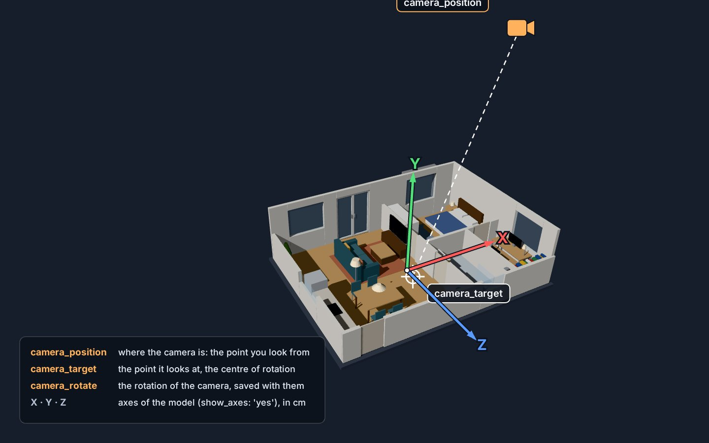
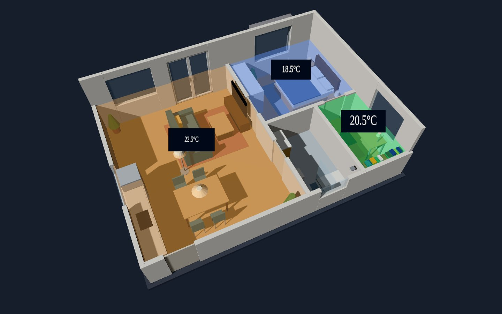
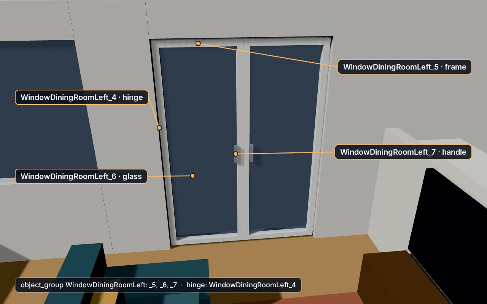
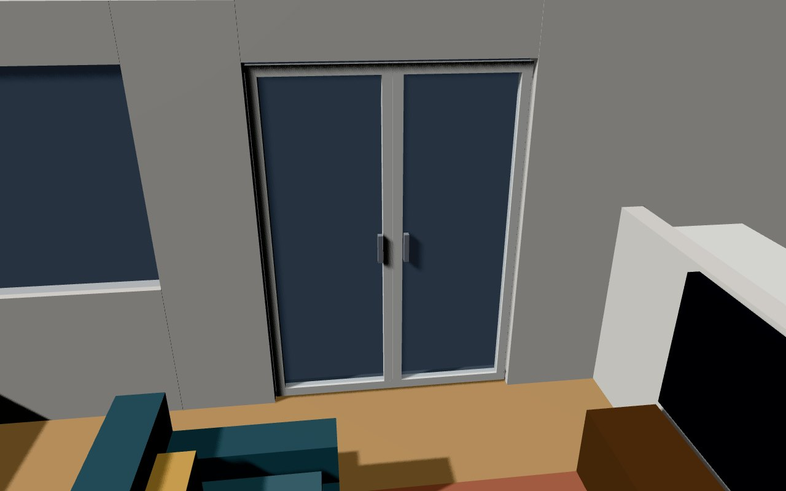
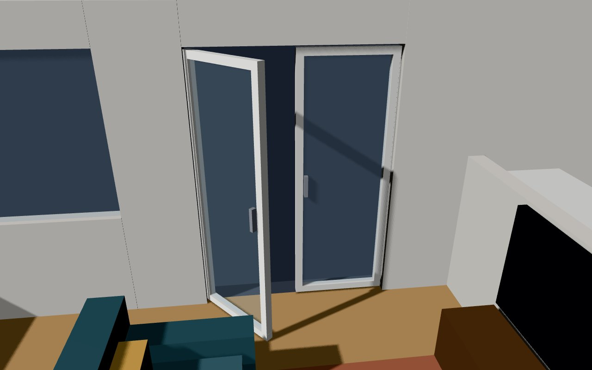
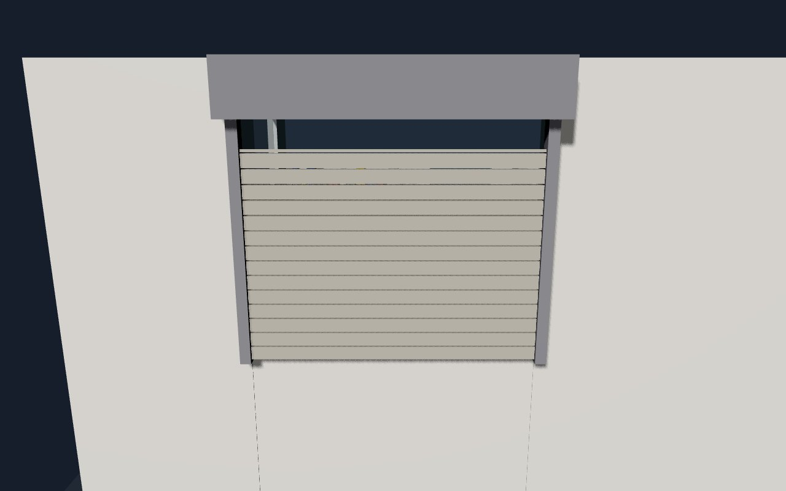
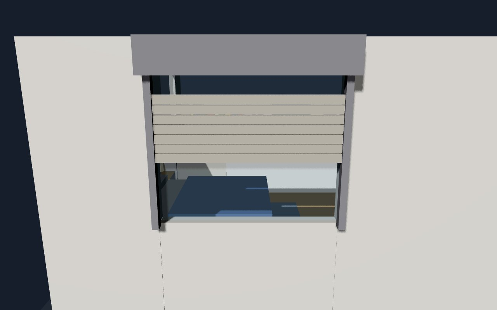

> **This is a fork** of [adizanni/floor3d-card](https://github.com/adizanni/floor3d-card) with updated libraries (three.js 0.186, Lit 3), a new card editor (objects picked with a tap in the preview), bug fixes and new features: see [FORK.md](FORK.md) for what changed. If the fork is useful to you, you can support it on [Buy Me a Coffee](https://buymeacoffee.com/giosci1994u). The rest of this page is the original documentation: the donation link and the ExportToHASS plugin below refer to the original card and its author.

# floor3d-card (aka Your Home Digital Twin)

[](https://buymeacoffee.com/AndyHA)

Javascript Module for the Home Assistant visualization Card for 3D Models with bindings to entity states.

| New Tutorial [](https://www.youtube.com/watch?v=ArBy7uqSJkY) | Your First Card [](https://youtu.be/4qrDpDnPK6I)  |
| ------------------------------------------------------------------------------------------------------------- | ----------------------------------------------------------------------------------------------------------------- |


## Installation

### HACS

[](https://my.home-assistant.io/redirect/hacs_repository/?owner=giosci1994&repository=floor3d-card&category=plugin)

1. Open the link above: HACS offers to add this repository. Or add it by hand: in HACS, menu (⋮) at the top right › **Custom repositories**, repository `https://github.com/giosci1994/floor3d-card`, type **Dashboard**.
2. Open **floor3d-card mod** and click **Download**. HACS adds the resource by itself.
3. Reload the browser or the app.

If the original floor3d-card is installed, remove it from HACS first: both define `custom:floor3d-card` and use the same `www/community/floor3d-card` folder. The configuration of the card stays the same.

### By hand

Copy all the `.js` files of the [latest release](https://github.com/giosci1994/floor3d-card/releases/latest) into a folder of `/config/www` and add `floor3d-card.js` as a resource (details in [FORK.md](FORK.md#installation)). It's **required** to load this card as `module`.

```yaml
- url: /local/floor3d-card/floor3d-card.js?v=2.0.0
  type: module
```

See Home Assistant documentation for adding custom cards (https://developers.home-assistant.io/docs/frontend/custom-ui/custom-card) and registering JavaScript resources (https://developers.home-assistant.io/docs/frontend/custom-ui/registering-resources).

## Model Design and Installation

Use a 3D modeling software. As you have to model your home I would suggest this software (the one I tested): http://www.sweethome3d.com/.
Model your home with all needed objects and furniture (I will post here some hints on how to better design your home for best results with the custom card).
For further instruction I assume you will use SweetHome3D.
At the end of your modeling, you need to export the files in obj format using '3D View \ Export to OBJ format ...', specify the folder where you want to store the output (be careful there are multiple files)
Copy the full set of files (minimum is the .obj file and .mtl file) to a sub folder of /config/www in Home assistant.
Be aware that when you remove objects from the model the object ids get reassigned: This means that after a modification and re-export of your model it is possible you need to redo the bindings with the new object names. The new feature (https://github.com/adizanni/floor3d-card/issues/7) is now available in this repository https://github.com/adizanni/ExportToHASS. It is a new plugin for Sweethome3D. It is still very experimental, use at your own risk, and please follow the instructions.
It could be also good practice to make the objects invisble instead of removing them (not yet tested if this solution preserves the objects ids).

If you want to have an object that groups together other objects (ex a mannequin is composed by 100s of objects you want to treat it as one), you can follow this trick: https://community.home-assistant.io/t/live-3d-floor-plan-with-interactive-objects/301549/78?u=adizanni.

Based on some feedback there are some open issues which I will try to fix, please follow these rules if you want things to go smooth:

- Place the upper left corner of your 2D floor model at 0,0 coordinates otherwise the camera setting will work weirdly (due to calculation on the coordinates that I need to fix)

When you are finished, configure a new card (either in panel mode or regular) with the following options:

### Note: GLB format

If you want to generate a glb file instead of the wavefront (obj) file to load the card (it is faster and more optimized), you can follow this procedure in Windows:
Install nodejs here https://nodejs.org/dist/v16.14.2/node-v16.14.2-x64.msi
Once installed you can open a command prompt (or powershell) and type the following command:
```bash
npm install -g obj2gltf
```
Then (always in the same command prompt) you just have the full wavefront obj model (either created with the builtin function or with my plugin) to a folder (obj, mtl, pictures), move to the folder (cd <folder>) and type the following command:
```bash
obj2gltf --checkTransparency -i home.obj -o home.glb
```
Assuming your model is called home.obj. You wait for some time (from few seconds to minutes) and when it is completed you can take the glb file and copy it to the www folder of Home Assistant. It is a self containing binary object so you just need that one file to load the model. This fork also loads `.glb` files compressed with meshopt or Draco, often several times smaller: see [FORK.md](FORK.md#compressed-models).

## Options

In this fork the yes/no switches also accept `true`/`false`, and the objects of a group can be plain ids: see [FORK.md](FORK.md#shorter-configuration).

| Name             | Type   | Default      | Description                                                                                                                                                                |
| ---------------- | ------ | ------------ | -------------------------------------------------------------------------------------------------------------------------------------------------------------------------- |
| type             | string | **Required** | `custom:floor3d-card`.                                                                                                                                                     |
| name             | string | Floor 3d     | the name of the card.                                                                                                                                                      |
| entities         | array  | none         | list of enitities to bind to 3D model objects.                                                                                                                             |
| object_groups    | array  | none         | list of object groups to apply grouped entity bindings.                                                                                                                    |
| style            | string | none         | the style that will be applied to the canvas element of the card.                                                                                                          |
| path             | string | **Required** | path to the Waterforont obj (objects), mtl (material) and other files.                                                                                                     |
| objfile          | string | **Required** | object file name (.obj) for Waterfront format or glb file name for the binary (condensed) 3d format (still experimental).                                                                                                                                 |
| mtlfile          | string | **Required** | material file name (.mtl) Waterfront format. Only relevant when objefile has obj extension (no glb)                                                                                                                               |
| backgroundColor  | string | '#aaaaaa'    | canvas background color: #RGB notation (ex #aaaaaa), color name (ex. 'white') or 'transparent' for a transparent background                                       |
| header  | string | 'yes'    | if the header will be displayed or not                                                                                                                                                   |
| editModeNotifications | string | 'yes'    | 'yes' to use the double click in edit mode to pop up the object ids or the camera position, 'no' to stop displaying popups                                            | 
| selectionMode | string | 'no'    | 'yes' to activate the selection mode and select group of objects, the list of selected objects will appear in the console                                            |
| globalLightPower | float  | 0.2          | intensity of the light that follows the camera (torch); it can also be the name of a numeric sensor, read at every update                                                  |
| shadow           | string | no           | 'yes' if lights cast shadow on object. This is realistic but impacts performances. By default wall, floors and objects with "door" in the name, receives and cast shadows  |
| extralightmode   | string | no           | 'yes' to activate the extra light mode. In this mode the max number of light who cast shadow at the same time (max texture unit image) is limited to the light that are switched with performance penalties  |
| overlay          | string | no           | 'yes' if you want to show an overlay panel for displaying data on the objects on click                                                                                     |
| click            | string | no           | 'yes' if you want to enable the click event. This will automatically disable the double click, you can manage the click behaviour at entity level via the action parameter |
| lock_camera      | string | no           | 'yes' to stop the zoom and rotate camera actions on the model                                                                                                              |
| show_axes        | string | no           | 'yes' to show the axes in the scene. It can help define the direction vector for the spotlight                                                                              |
| sun              | string | no           | 'yes' to light the model with the sun, placed like the sun.sun entity (azimuth and elevation), with shadows. It replaces the `sky` option of the original card: see [FORK.md](FORK.md#light-and-colours) for `sun_power`, `sun_roof`, the light of the sky (`sky_power`) and the other lighting options|
| north            | string | see desc     | north is the direction of the north on the x-z plane. ex. {x: 0, z: -1} (this is the default) for a north in the z negative direction (see axes explanation). It orients the sun (`sun: yes`)|
| overlay\_<style> | string | various      | allow to manage the aspect of the overlay panel (colors, fonts, etc.)                                                                                                      |

**Note: with the sun (`sun: yes`), the illumination will behave strangely when the sun will go above the ceiling. I've given the possibility to manage what I call a transparent slab. In sweethome3d put a transparent slab object (transparent box) on top of your floor and call it transparent_slab*. If you use my plugin (Export to HA) this will be managed by the card by stopping the sunlight to come through from the above. It is also possible to activate the ceiling in Sweethome3d. In this fork you can also list the indoor floors in `sun_roof` instead (see [FORK.md](FORK.md#light-and-colours)).**

**Note 2: a valid north setting example:
```yaml
north:
  x: -1
  z: 0
```

For each entity in the entities list you need to specify the following options:

| Name            | Type   | Default      | Description                                                                                                                                                                                                                                                                                         |
| --------------- | ------ | ------------ | --------------------------------------------------------------------------------------------------------------------------------------------------------------------------------------------------------------------------------------------------------------------------------------------------- |
| entity          | string | **Required** | your entity id or reference to an object_group via <object_group> reference (this last feature is not applicable for text and gesture                                                                                                                                                               |
| entity_template | string | none         | a JavaScript template formatted as follow: [[[ template]]]. Template is a valid Javascript command. With $entity you specify the state of the entity (a number when the state is numeric)                                                                                                                                                |
| action          | string | none         | on-click behaviour: it can be 'more-info' to open the more-info dialog for the entity associated to the clicked objec; it can be 'overlay' to display the state of the entity in the ovelay panel; it can be 'default' to do the same action that used to be associated to the double click action. |
| object_id       | string | **Required** | the name of the object in the model to bind to your entity.                                                                                                                                                                                                                                        |
| type3d          | string | **Required** | the type of object binding. Values are: light, hide, show, color, text, room, gesture, door, cover, rotate, camera; this fork adds image, info, shower and tracker (see [FORK.md](FORK.md#new-features))                                                                                            |

**Note: to facilitate the configuration you can load the model without entity bindings and you will be able to show the object_id you want to bind to by double clicking on the object**

For each object_group in object_groups:

| Name         | Type   | Default      | Description                                                                                                                             |
| ------------ | ------ | ------------ | --------------------------------------------------------------------------------------------------------------------------------------- |
| object_group | string | **Required** | your object group name to be referenced by the entity field via <object_group> reference (braces <> have to wrap the object_group name) |
| objects      | array  | **Required** | the list of object_ids in your group.                                                                                                   |

The objects array contains a list of
| Name | Type | Default | Description
| ---- | ---- | ------- | -----------
| object_id | string | **Required** | object_id of the object in the group

Here is a Tutorial for Object Groups:

| Object Groups Tutorial
| -------------------------
| [](https://www.youtube.com/watch?v=eAbaDfNw93M)

For each zoom in zoom_areas

| Name             | Type   | Default      | Description                                                                                                                                                                |
| ---------------- | ------ | ------------ | -------------------------------------------------------------------------------------------------------------------------------------------------------------------------- |
| zoom             | string | **Required** | the name of the zoom area (ex. Kitchen).                                                                                                                                    |
| object_id        | string | **Required** | the object id of the target of the zoom (ex. room_1_1)                                                                                                                      |
| rotation         | object | {x:0, y:0, z:0} | the rotation of the camera pointing to the area.                                                                                                                                                      |
| direction        | object  | {x:0, y:0, z:0}   | the direction vector of the canera pointing to the area.                                                                                                                             |
| distance        | number  | 500   | the number of cm from the camera to the target point                                                                                              |
| level        | number  | - | the index of the level. If set, selecting this zoom level will show the level and hide the other levels. If not set, all the levels are shown.                                                                                 |


### Client Side Javascript template example

```yaml
- entity: sensor.temperature
  type3d: color
  colorcondition:
    - color: red
      state: hot
  object_id: your_object
  entity_template: '[[[ if ($entity > 25) { "hot" } else { "cool" } ]]]'
```

The example above shows a potential usage of the Client Side Javascript template example. If the state of the entity is greater than 25, the templated state of the entity will be 'hot' thus the object 'your_object' will become red

## Camera Rotation, Camera Position and Camera direction

For **camera rotation and position** recording config:

```yaml
camera_position:
  x: <x coordinate of the recorded camera positioon>
  y: <y coordinate of the recorded camera positioon>
  z: <z coordinate of the recorded camera positioon>
camera_rotate:
  x: <x coordinate of the recorded camera rotation>
  y: <y coordinate of the recorded camera rotation>
  z: <z coordinate of the recorded camera rotation>
 camera_target:
  x: <x coordinate of the recorded camera target>
  y: <y coordinate of the recorded camera target>
  z: <z coordinate of the recorded camera target>
```

When in edit mode you can double click in an empty model space to retrieve the current postition and rotation of the camera. You can retrieve the 2 sets of coordinates from the prompt box that will appear. You can then manually copy the content and paste to the card config in code editor mode. Thanks to this the new default position of the camera will be set to the configured coordinates.

An image explaining the coordinate concepts:



## Overlay and action

You first put overlay yes in the Appearance section of the card visual editor. Then a few other Overlay parameters appear to customize the overlay: alignment, size, fonts, colors, etc.
All this will create a panel that will sit on top of the model canvas.
You will also have to put the click parameter to yes for it to work.
Then in each entity you have the action parameter; this tells what to do when you click on the object associated to the entity.
If action = overlay for an entity, it means that when you click on it, it will display the name and state of the entity inside the overlay.

Example:

```yaml
........
overlay: 'yes'
overlay_bgcolor: transparent
.........
click: 'yes'
entities:
  - entity: <your_entity>
    object_id: <your_object_id>
    action: overlay
    .........
```

When you click on the object, the entity name and state will appear in the overlay panel

In this other example the click will trigger the pop of the more-info dialog (overlay not needed):

```yaml

.........
click: 'yes'
entities:
  - entity: <your_entity>
    object_id: <your_object_id>
    action: more-info
    .........
```

## Camera

For camera, example config:

```yaml
entities
  - entity: camera.<camera name>
    type3d: camera
    object_id: <an object_id in the model you want to associate with the camera>
```
there are no specific parameters. Double clicking on the object will show a pop-up dialog with the camera picture.

## Lights

For **light** example config:

```yaml
entities:
  - entity: <a light entity id>
    type3d: light
    object_id: <an object id in the 3D model you want to postion the light on>
    light:
      lumens: <max light lumens range: 0-4000 for regular led/bulb lights>
      color: <light color, if the light is a led with variable color this parameter will be ignored in favor of color and temperature attributes>
      decay: <0-2, the speed of decay for the light between the light source and the distance>
      distance: <number of cm for which the light will have an effect on the scene>
      shadow: <'no', if you do not want this light to case a shadow. This is to cope with the limit of max lights casting shadow in a model>
      vertical_alignment: <'top', 'middle', 'bottom', when you activate shadows it allows to avoid that the lamp itself block the light>
      light_target: when this parameter is filled, the light becomes a spotlight, you need to put here the object_id of the target of the spot
      light_direction: when this parameter is filled, the light becomes a spotlight, you put here the direction vector of the spotlight. It can only be changed in the code editor. in the format x: xxx, y: yyy, z: zzz. See coordinate explanation above
```

Light behaviour is obvious: the **light_name** will illuminate when the bound entity in Home Assistant will be turned on and viceversa. If the light has color and brightness attributes they will be used to render the light.
A double click on the light object will toggle the light. With `click: 'yes'` a tap toggles it and a long press opens its details, on phones too.

## Hide

For **hide** example config:

```yaml
entities
  - entity: <a binary sensor entity id>
    type3d: hide
    object_id: <an object_id in the model you want to hide if condition is true>
    hide:
      state: <the state of the entity triggering the hiding of the object: ex 'off'>
```

Hide behavour: the object_id will be hidden when the state of the bound entity will be equal to the **state** value

## Show

For **show** example config:

```yaml
entities
  - entity: <a binary sensor entity id>
    type3d: show
    object_id: <an object_id in the model you want to show if condition is true>
    show:
      state: <the state of the entity triggering the showing of the object: ex 'off'>
```

Show behavour: the object_id will be visible when the state of the bound entity will be equal to the **state** value

## Color

For **color** example config:

```yaml
entities:
  - entity: <a discrete sensor entity id>
    type3d: color
    object_id: <the object id in the 3D model that has to change color based on the state of the entity>
    colorcondition:
      - color: <color to paint if condition for the entity id in the stat to be true, it can be in Hex, html or rgb format (ex. '#ff0000' or 'red' or '255, 0, 0' >
        state: <state of the entity>
      .......
```

Color behavour: the object_id will be painted in the color when the state of the bound entity will be equal to the **state** value

## Text

For **text** example config:

```yaml
entities:
  - entity: <a numeric or text sensor entity id>
    type3d: text
    object_id: <the plane object id in the 3D model that will allow the display of the state text>
    text:
      span: <percentage span of text in the object plane> (ex. 50%)
      font: <name of the font text ex:'verdana'>
      textbgcolor: <background color for the text. ex: '#000000' or 'black'>
      textfgcolor: <foreground color for the text. ex: '#ffffff' or 'white'>
      attribute: the optional attribute of the entity you want to show on the object
      .......
```

Text behaviour: the object_id representing the plane object (ex. mirror; picture, tv screen, etc) will display the state text for the entity

## Room

For **room** example config:

```yaml
entities:
  - entity: <an entity>
    type3d: room
    object_id: <a room object (generally the floor) with a name containing "room". >
    room:
      elevation: <Number of cm going from the floor to the ceiling to set the parallelepiped height of the new room object>
      transparency: <Percentage of transparency of the room object>
      color: <color of the parallelipiped: ex: '#ff0000' or 'red'>
      label: <yes or no, default no: shows a label with the state of the entity or attribute (see below)>
      label_text: <'state' to write the state of the entity in the label, 'template' for the entity template>
      span: <percentage span of text in the object plane> (ex. 50%)
      font: <name of the font text ex:'verdana'>
      textbgcolor: <background color for the text. ex: '#000000' or 'black'>
      textfgcolor: <foreground color for the text. ex: '#ffffff' or 'white'>
      attribute: the optional attribute of the entity you want to show on the object
    colorcondition:
      - color: <>
        state: <>

```

Room will draw a parallelipiped highlighting the room. Pretty static for the moment, it will become more dynamic with new parameters. It works with all room (floor) objects containing the word "room" in the object name. Rooms that have not a rectangular shape will have a paralllipiped anyway (not managing complex shapes).

You can add a colorcondition section for rooms.



## Gesture

For **gesture** (action) example config:

```yaml
entities:
  - entity: <an actionable entity>
    type3d: gesture
    object_id: <an object id in the 3D model you want to double click to trigger the gesture/action>
    gesture:
      domain: <the domain of the service to call>
      service: <the service to call>
```

when you double click on the object, the domain.service is called with data { entity_id: entity }
(so far the iOS and Android events are not yet managed as the events are captured by the OrbitContol of Three.js library and I have not yet fully understood the behaviour)

## Door

For **door** example config:

```yaml
entities:
  - entity: <a on/off  entity>
    type3d: door
    object_id: <an object or object_group id representing the door>
    door:
      doortype: <'slide' for sliding doors/windows, 'swing' for swinging doors windows>
      side: 'up', 'down', 'left' and 'right', the border of the door that is the axis of rotation
      direction: 'inner' and 'outer', the direction of rotation
      hinge: the object_id of the door/window hinge
      pane: the object_id of the pane (main component) of the door/window
      degrees: the degrees of the door opening
```

a door/window object/entity is rotated by the sepcified degrees (swing) or slid (slide) along the axis defined in 'side' and the direction defined in 'direction'. You can use the object group to list the moving objects of the door. If you do that you can now select the hinge object or the pane object. When you select the hinge object only the direction parameter is used as the side and axix of rotation are bound to the hinge position and shape. Time allowing I will try to do a tutorial. It is getting complex.....

Different cases here:

For a Swing door:

| Type                   | Direction | Side | Degrees | Comment                                                           |
| ---------------------- | --------- | ---- | ------- | ----------------------------------------------------------------- |
| hinge object specified | x         |      | x       | -                                                                 |
| pane object specified  | x         | x    | x       | -                                                                 |
| no object specified    | x         | x    | x       | the object_id is taken as a pane or the first object of the group |

For a slide door (only pane object):

| Type                     | Direction | Side | Percentage | Comment                                                           |
| ------------------------ | --------- | ---- | ---------- | ----------------------------------------------------------------- |
| pane object specified    | x         | x    | x          | -                                                                 |
| no pane object specified | x         | x    | x          | the object_id is taken as a pane or the first object of the group |

Example of configuration for a window (Double French Window) exported using the ExportToHass plugin:



The entity section:

```yaml
- entity: your_domain.your_door_entity
  object_id: <WindowDiningRoomLeft>
  type3d: door
  door:
    doortype: swing
    direction: inner
    degrees: '50'
    hinge: WindowDiningRoomLeft_4
```

And the related object group:

```yaml
- object_group: WindowDiningRoomLeft
  objects:
    - object_id: WindowDiningRoomLeft_7
    - object_id: WindowDiningRoomLeft_6
    - object_id: WindowDiningRoomLeft_5
```

Result:

|  |  |
| :---: | :---: |
| Closed (off) | Open (on): the pane turns 50° on its hinge |

## Cover

```yaml
entities:
  - entity: <cover.your_cover_entity>
    type3d: cover
    object_id: <object_id or group of the moving parts of the cover, the blades and base of a roller shutter>
    cover:
      pane: <object_id represents the moving parts that have to fully disappear when the cover is fully opened>
      side: <up or down, direction of opening
```

It is an experimental implementation of cover entities.

|  |  |
| :---: | :---: |
| Closed (current_position: 0) | Open at 45% (current_position: 45) |


## Rotate

For **rotate** example config:

```yaml
entities:
  - entity: <a on/off  entity>
    type3d: rotate
    object_id: <an object or object group id representing the thing to be rotated>
    rotate:
      axis: <'x', 'y' and 'z', along which axis the object should rotate>
      round_per_second: 1-4, speed of rotation. Use a negative number to spin the other direction.
      ramp: seconds to reach full speed and to stop, 1.5 by default, 0 to start and stop at once (this fork, see FORK.md)
      hinge: the object acting as a pivot when you use an object group to represent the moving parts.
```

an object to rotate (animation) when the associated entity will be 'on'. With a fan entity the speed follows its `percentage` attribute, and `direction: reverse` turns it the other way. If you use an object group and you specify the hinge, all moving parts in the group will rotate aroung the hinge center point.

## Object group example

```yaml
entities:
  - entity: light.bulb
    type3d: light
    object_id: <lamp> (refers to the object_group defined below, braces <> have to wrap the object_group name)
    light:
      lumen: 900
object_groups:
  - object_group: lamp
    objects:
      - object_id: lamp_base_20
      - object_id: lamp_bulb_1
```

### Example

To give it a try please, load the example folder files in a folder within /config/www of your Home Assistant.
Create a new Panel View add Floor3d-card and cut and paste the following config:

```yaml
type: 'custom:floor3d-card'
entities:
  - entity: <your light entity id>
    type3d: light
    object_id: sweethome3d_opening_on_hinge_2_LampSide_31
    light:
      lumens: 500
  - entity: <your binary sensor entity id (example a magnet sensor for a window)>
    type3d: color
    object_id: sweethome3d_window_pane_on_hinge_1_50
    colorcondition:
      - state: 'on'
        color: '#00ff00'
      - state: 'off'
        color: '#ff0000'
path: /local/home2/
objfile: MyExampleHome2.obj
mtlfile: MyExampleHome2.mtl
backgroundColor: '#000001'
globalLightPower: 0.4
```

### Working with levels (> v1.3.0)

If your Sweethome3d model has levels and you use the ExportToHass ([Download](https://github.com/adizanni/ExportToHASS/releases/latest/download/ExportToHASSPlugin.sh3p)) plugin, the card will show the levels with some buttons appearing at the top left of the 3d canvas. There is one button for each level and one butto for "all" levels. When you click on the button of the level, only that level will become visible in the card, and if you click on the "all" button all levels will appear in the card in a total view of your model.
All other functionalities will work as before.

### Note about GPUs

For one who has a computer with 2 (or more) gpus, like in laptops with a second NVIDIA gpu, one may notice that either Chrome or Firefox actually use the internal Intel UHD Graphics instead of NVIDIA.
That makes the rendering slow and the experience frustrating.
Steps to dramatically improve the rendering.

- A. **Firefox** In NVIDIA Control Panel 3D Settings->Manage 3D Settings->Program Settings Tab->1. Select a program to customise->Mozilla Firefox → 2. Select The preferred graphics processor->High performance NVIDIA → 3. OpenGL rendering GPU → NVIDIA; In Firefox address bar, type about:config. Search ‘webgl.disable-angle’ and set it to true (that instructs Firefox to use OpenGL).

- B. **Chrome** In NVIDIA Control Panel 3D Settings->Manage 3D Settings->Program Settings Tab->1. Select a program to customise->Google Chrome-> 2. Select The preferred graphics processor->High performance NVIDIA → 3. OpenGL rendering GPU → NVIDIA; In Chrome address bar, type chrome://flags/#use-angle. Select OpenGL. Restart Chrome; In Chrome address bar, type chrome://gpu. Search for ‘GL_RENDERER’ and check if it say 'ANGLE (NVIDIA … OpenGL … ); I still experiment with ‘chrome://flags/#enable-drdc’.

- C. **Edge** In NVIDIA Control Panel 3D Settings->Manage 3D Settings->Program Settings Tab->1. Select a program to customise->Edge-> 2. Select The preferred graphics processor->High performance NVIDIA → 3. OpenGL rendering GPU → NVIDIA; In Chrome address bar, type edge://flags/#use-angle. Select OpenGL. Restart Edge; I couldn’t figure out how to do it in Edge. It should be like chrome, because Edge is chromium. But for some reason it doesn’t work. Checking edge://gpu GL_RENDERER shows Direct3D11 instead of OpenGL.
